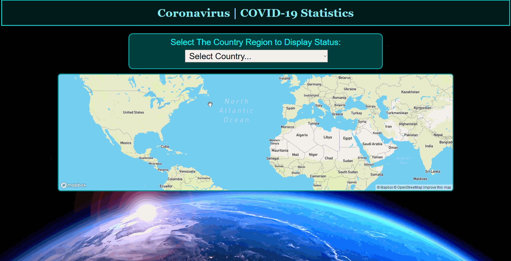

# About The Project

## The Second Project Coronavirus Statistic

Need to know what's the daily status report of COVID-19 spread and get safe staying at home.
The website app is responsive with smartphone & tablet. Beautifully wide design and organized table data such as displaying flag, number of cases, active etc. 
It's been created in second semesters task assignment at college with excellent score.

Built with: 
* `HTML`
* `SCSS / CSS`
* `JavaScript & AJAX Fetch API`.

## Demo
Use the app online at 'url' is coming soon



## Prerequisites

* **[Visual Studio Code](https://code.visualstudio.com/)** (Compatible with Windows / Mac or Linux) and **must install two extensions:**
  * **[Live Sass Compiler](https://marketplace.visualstudio.com/items?itemName=ritwickdey.live-sass)** | To generate all `CSS` from `SCSS` in `styles/` folder.
  * **[Live Server](https://marketplace.visualstudio.com/items?itemName=ritwickdey.LiveServer)** | To host online.
* Get a free API Key from **[mapbox](https://www.mapbox.com/)**.

**Note:** My personal preference is Visual Studio Code, I'm sure there are other text editors with equivalent extensions/plugins that can be used with this project.

## Opening COVID-19 API
To be able to see live statistics, follow these steps:

1. Clone/Download my project and place it in your desired location. Right click on `covid-19-api` root folder then click `Open with Code`.

2. When you open VS Code, on **Explorer** tab, click `New file` and type `config.js` then copy the following code to this file: 
```JS
const API_KEY = 'YOUR_MAPBOX_ACCESS_TOKEN';
```
Replace `YOUR_MAPBOX_ACCESS_TOKEN` with your free API key accessToken from [mapbox](https://www.mapbox.com/).

3. Click `Watch Sass` on bottom right to begin generating all `CSS`.

4. Finally, make sure to `Save All` files. On **Explorer** tab, right click on `index.html` then `Open with Live Server`. That's it, enjoy my responsive covid-19 statistic project.

> Stay Home, Stay Safe

<!-- LICENSE -->
## License

Distributed under the MIT License. See `LICENSE` for more information.